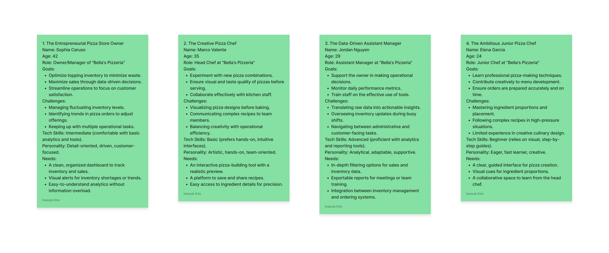
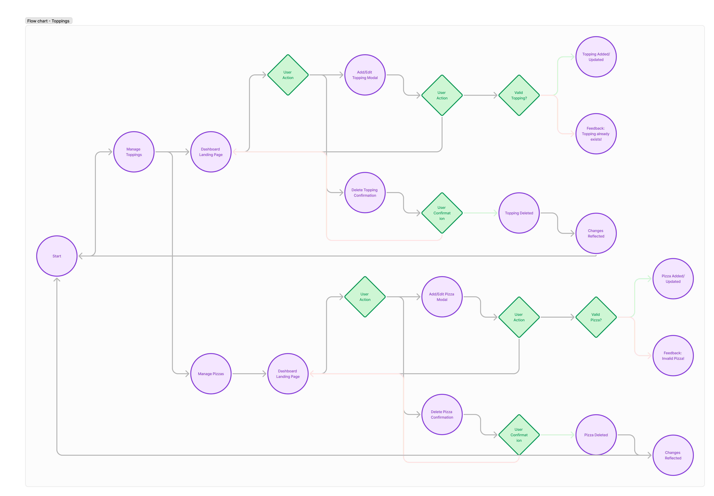
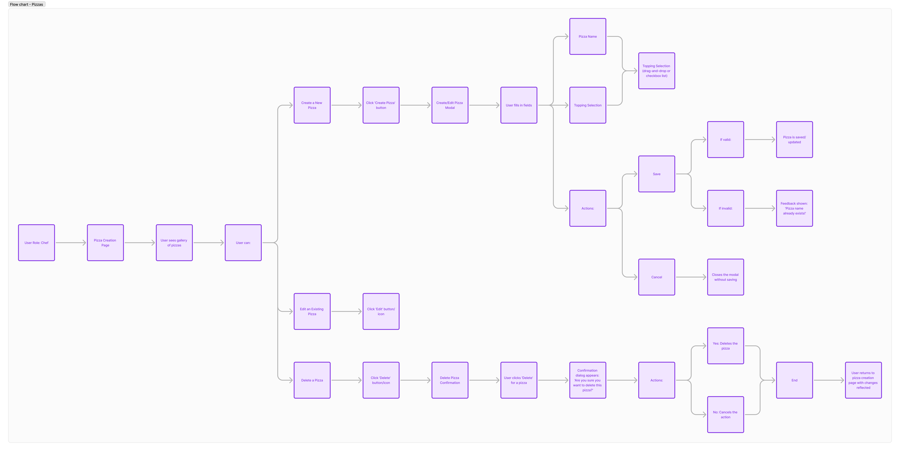
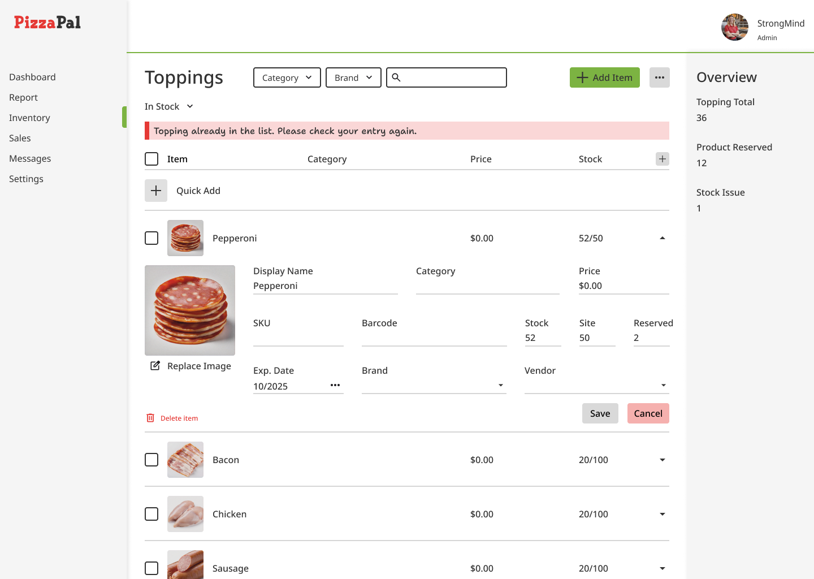
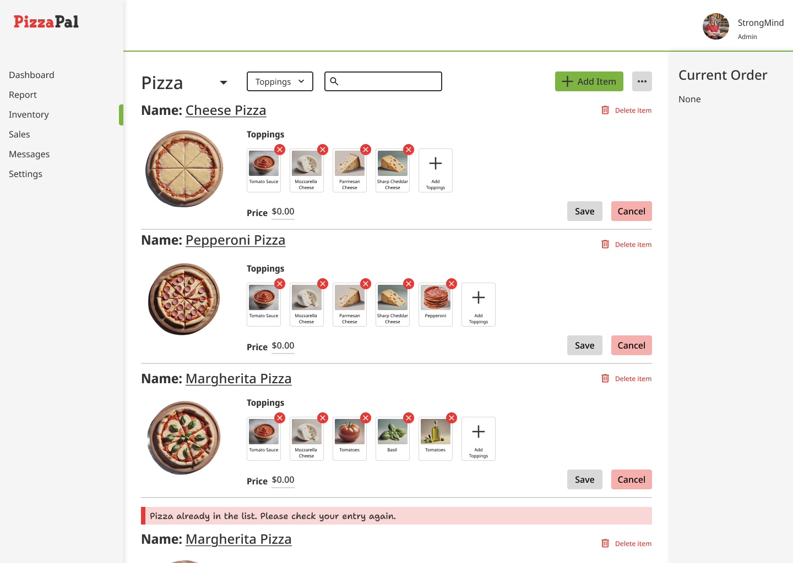

# Topping_Management
 Design Exercise
### Overview
This document presents the user experience design for a pizza store management interface, focusing on two main user stories: “Manage Toppings” and “Manage Pizzas”.
### Objectives
- Create an intuitive and visually appealing dashboard to manage toppings and pizzas.
- Enable quick identification of toppings and pizzas through clear visuals or descriptive names.
- Simplify the processes of adding, updating, or deleting toppings and pizzas.
- Provide actionable feedback for duplicate entries (e.g., duplicate names).
- Ensure accessibility for all users by adhering to best practices.
### User Personas
#### Pizza Store Owner
- **Goals:** Efficiently manage the topping inventory.
- **Pain Points:**
    - Difficulty quickly identifying toppings.
    - Need for an easy-to-use interface for managing inventory.
    - Desire for clear feedback during actions.

#### Pizza Chef
- **Goals:** Easily create and manage pizza variations.
- **Pain Points:**
    - Need for a clear visualization of pizza compositions.
    - Desire for simple and effective management of pizzas and toppings.
    - Need for distinct visual separation between different pizza types.

 

### User Research
The user research, based on competitive analysis, personas, and user flows, revealed the following key insights:
- Users prioritize simplicity, speed, and clear visual cues for identifying toppings and pizzas.
- Preventing errors and ensuring accessibility (e.g., avoiding duplicates) are critical. These insights shaped the design to ensure an efficient, seamless user experience.
### Manage Toppings UI
#### Design Decisions and Rationale
- The Manage Toppings page is organized into a grid layout, displaying each topping’s image, name, and price, allowing the pizza store owner to quickly distinguish and manage toppings.
- A dedicated “Stock Status” filter helps efficiently manage inventory by showing available toppings.
- The “Quick Add” feature simplifies the process of adding new toppings, reducing management friction.
- The “Delete Item” option empowers the owner to remove toppings, giving them complete control over the inventory.
- The “Replace Image” feature allows the owner to update topping images, ensuring the interface reflects current offerings.
### User Experience Considerations
- **Accessibility:** Clear text labels and high-contrast design elements ensure accessibility for users with varying visual abilities.
- **Feedback:** The system provides immediate feedback when a duplicate topping is entered, preventing errors and maintaining data integrity.
- **Scalability:** The grid layout is designed to accommodate a growing number of toppings without compromising usability.
- **Efficiency:** Visual cues, quick-add functionality, and deletion options streamline topping management, saving time and effort.

### Manage Pizzas UI
#### Design Decisions and Rationale
- The “Manage Pizzas” page uses the same grid layout of the Manage Toppings page, ensuring a consistent experience across both sections.
- Each pizza’s name, image, and price are clearly displayed for easy overview.
- The Toppings section for each pizza allows the chef to quickly see the toppings for each variation.
- The “Delete Item” option gives the chef control over the pizza menu.
#### User Experience Considerations
- **Consistency:** The design maintains layout and interaction consistency with the Manage Toppings page, ensuring a unified experience.
- **Feedback:** The system prevents errors by providing feedback when a duplicate pizza name is entered.
- **Customization:** The ability to replace pizza images enhances branding and visual appeal, offering tailored representations of the pizza menu.
- **Efficiency:** The organized layout and streamlined topping management enhance the chef’s productivity, enabling quick pizza creation and editing.

### Conclusion
The design for both the “Manage Toppings” and “Manage Pizzas” interfaces prioritizes clarity, usability, data integrity, and accessibility. These considerations ensure that the system is intuitive, efficient, and adaptable to the needs of both the pizza store owner and chef.